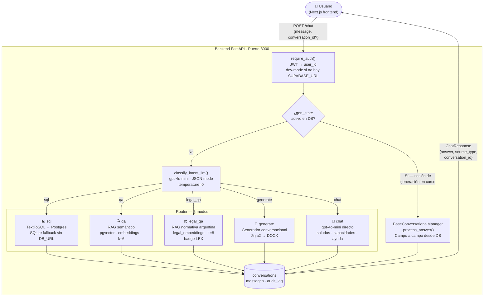
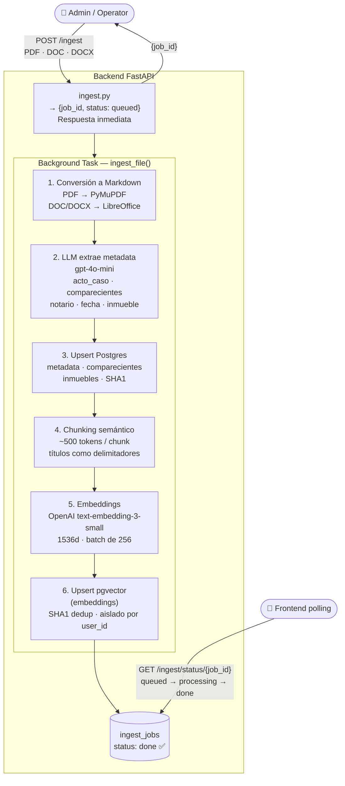

# Arquitectura de NotarIA

Sistema de IA para escribanías argentinas. Ingesta escrituras públicas (PDF/DOC), extrae
metadata estructurada, responde consultas en lenguaje natural mediante SQL + RAG, genera
documentos DOCX desde plantillas legales y permite consultas jurídicas sobre normativa
notarial argentina.

---

## Diagrama 1 — Flujo de una consulta

---

## Stack tecnológico

| Capa | Tecnología |
|---|---|
| Frontend | Next.js 15 (App Router) + shadcn/ui |
| Backend | FastAPI + asyncpg |
| Autenticación | Supabase Auth (JWT RS256/JWKS) · dev-mode sin config |
| Base de datos | Postgres (Supabase) + pgvector · SQLite como fallback local |
| LLM cloud | OpenAI gpt-4o-mini (clasificación, SQL, síntesis, chat) |
| LLM local (opcional) | Ollama qwen3:14b (RAG synthesis, generación de docs) |
| Embeddings | OpenAI text-embedding-3-small · 1536 dimensiones |
| Búsqueda vectorial | pgvector HNSW (cosine, m=16) · escrituras k=6 · normativa k=8 |
| Generación de documentos | Jinja2 + python-docx · data-driven desde YAML |
| Deploy | Railway (backend) + Vercel (frontend) + Supabase (DB) |

---

## Diagrama 2 — Flujo de ingesta

---

## Decisiones de diseño clave

- **Índice `legal_embeddings` separado y sin `user_id`**: la normativa argentina (CCC, Ley 404, Ley 17.801) es pública y compartida entre todos los tenants. Mezclarla en la tabla `embeddings` requeriría duplicarla por tenant (mismo embedding, N copias) sin ningún beneficio de aislamiento. La ausencia de `user_id` en el schema es una decisión activa: hace imposible pasar un tenant por error en el código.

- **`gen_state` en columna JSONB de `conversations`**: el estado del generador conversacional (qué campos se recolectaron, en qué turno va) se serializa a la DB después de cada turno. Esto permite que el proceso sobreviva reinicios del servidor de Railway y funcione con múltiples workers sin coordinación en memoria.

- **Auto-selección SQLite / Postgres según `DATABASE_URL`**: si la variable no está configurada, el backend funciona con SQLite local sin cambios de código. Permite desarrollar sin conexión a Supabase. En producción, el mismo código usa Postgres con multi-tenancy completo.

- **Degradación con gracia en `legal_qa`**: si pgvector no está disponible (excepción en `query_legal_index()`), `_answer_from_legal_qa()` captura el error y responde igual usando el conocimiento entrenado del modelo sin contexto RAG. El endpoint nunca crashea por indisponibilidad del índice.

---

## Pendientes conocidos

- **Deploy en producción**: Railway (backend) + Vercel (frontend) configurados en `docs/deploy.md` pero sin instancia activa. Pendiente conectar `DATABASE_URL` de Supabase y variables de entorno en Railway.
- **Dataset de evaluación formal**: la skill `testing.md` describe `tests/evaluation/queries.json` con 60+ queries etiquetadas para medir accuracy del router, SQL y RAG. El dataset no está construido aún — es el entregable central de la tesis (dic 2026).
- **Streaming de respuestas**: las respuestas largas de RAG llegan en un solo bloque HTTP. Agregar SSE o WebSocket para streaming mejora la experiencia percibida de latencia, especialmente con Ollama local (síntesis de 4-8 segundos).
